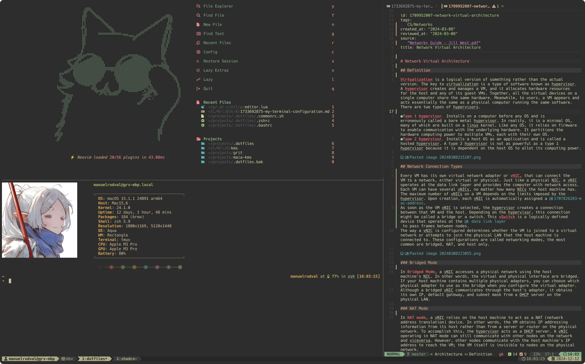
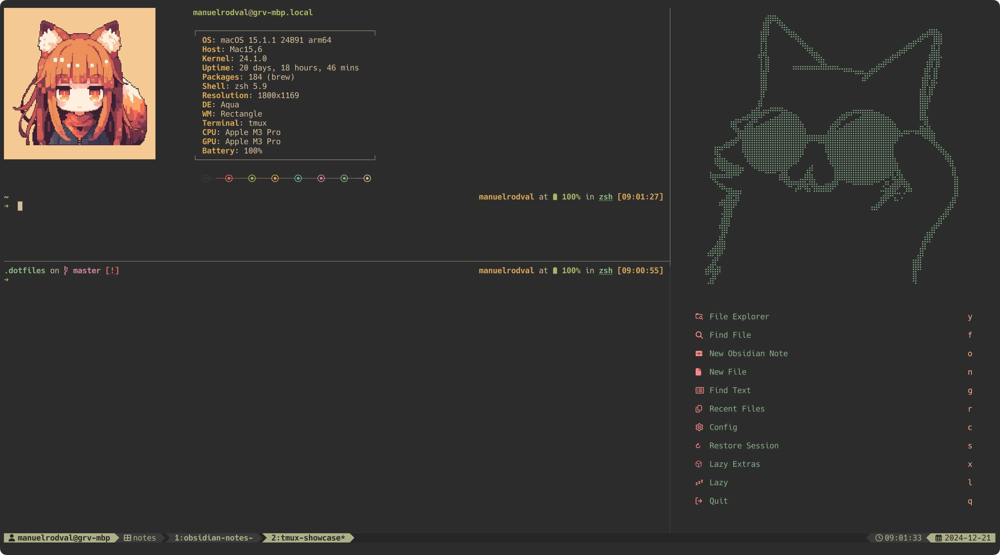

An outline of the most important tools I use on my daily workflow. I'll keep updating this post whenever there is a major change in my setup.

<!-- sep -->

# My Terminal Configuration

In the quest to be more productive and code faster (skill issue coping), I've set up my terminal with some handy tools to enjoy a mouse-free coding experience.
This post aims to explain how to configure these tools, but I also hope it serves as an entry point for the curious who want to customize their coding environment, explore technologies, and perhaps even develop new ones.



This reference guide works in macOS y Linux mostly. If you are not using WSL in windows, you might need to configure things differently.

If you’d rather skip the yapping and dive straight in, here’s the [link](https://github.com/manuelrodval/.dotfiles) to the repository with the complete code. While I’ll be showing some snippets from my configuration, you’ll need the full setup from the repository for everything to work.

## Stow and dotfiles management

Working with dotfiles and keeping them updated with your latest changes can be a bit annoying. To speed things up and solve the pain of deploying configurations to new machines, I save my configuration files in a GitHub repository and use Stow to deploy them and easily commit changes.

Stow is a GNU tool that manages symbolic links between a source tree and a target tree. Recently, it's become a popular choice for managing dotfiles and configuration files. You can learn more about the project [here](https://www.gnu.org/software/stow/).

For the purposes of this, the only command you need to know is:

```bash
stow --target=$HOME --dir=/path/to/dotfile/repository/ .
```

This command grabs every file inside your configuration repository, and creates symlinks to them in your home directory.
If you want to work with files that aren't hidden by default in file explorers, you can use the `--dotfiles` flag. It renames files and folders like `dot-config` in your source directory to `.config` in the target directory. Personally, I skip this because most LSP servers won't recognize the file type, and I don't want to deal with that.

To get started, create a directory in your projects folder (or wherever you want), then create a repository and make it remote in your GIT service of choice.
I use the [GitHub CLI](https://cli.github.com/) to manage this stuff.

```bash
mkdir -p path/to/your/dotfiles && cd path/to/your/dotfiles && git init .
```

## Terminal, Shell and looks

Just as a reminder, your shell and your terminal are different things:

- **Terminal**: Software that lets you interact with the system shell and command-line tools.
- **Shell**: A command-line interpreter that takes your input, processes it, and talks to the OS to perform tasks.

There are tons of terminal emulators and shells out there with lots of features, but I like to keep it simple. I found that WezTerm and zsh (z-shell) are powerful yet straightforward enough, which is why I stick to them in my daily workflow.

Before diving into the configurations, you'll need to install a [nerdfont](https://github.com/ryanoasis/nerd-fonts?tab=readme-ov-file#font-installation) to make icons and symbols render properly. There are a ton of options, but I personally use the Hack font - it's clean enough.

### Wezterm

Yes, it is written in Rust. Yes, it is blazingly fast 🚀.

The real reason I use this is that it's easy to configure and keeps things looking clean and not bloated. I just want my terminal, no toolbars or other unnecessary stuff.

WezTerm also supports the iTerm image rendering protocol, making it compatible with other tools and allowing you to preview certain file types directly in the terminal.
After installing [WezTerm](https://wezfurlong.org/wezterm/installation.html), you'll have to create a `.wezterm.lua` file in a `$HOME/.config/wezterm/` directory. There you can setup your terminal by pulling in the WezTerm API and adding some fields to the config table.

```lua
local wezterm = require("wezterm")
local config = wezterm.config_builder()

-- Color scheme example
config.color_scheme = "Gruvbox Material (Gogh)"

return config
```

### Shells, Bash and Zsh

A shell is a command-line interpreter that provides a user interface for interacting with the operating system. It executes commands, runs scripts, and manages user interaction in a terminal environment.

**Bash** (Bourne Again Shell) was created in the 1980s and became the default shell on most Linux distributions and macOS (until 2019, when it switched to Zsh). **Zsh** was created in the 1990s to build on Bash by adding features like advanced customization options, plugins, and better default configurations.

I use Zsh in my daily workflow, but I also maintain a Bash configuration file for working on new machines where Bash is the default shell. To handle both configurations easily, I use a common configuration file for shared settings like aliases, scripts, and environment variable declarations. This keeps everything centralized and manageable.

Here’s an example structure:

```bash
├── .bashrc
├── .zshrc
├── .commonrc.sh
```

To pull your common configuration, add this line to both your `.zshrc` and `.bashrc` files.

```bash
source $HOME/.commonrc.sh
```

Plugin management in Zsh is handled by [Zinit](https://github.com/zdharma-continuum/zinit), which allows you to load plugins (duh), themes, and other customizations. It also supports **lazy loading**, which helps speed up the shell's startup time.

To install Zinit, add the following lines to your `.zshrc`:

```bash
ZINIT_HOME="${XDG_DATA_HOME:-${HOME}/.local/share}/zinit/zinit.git"
[ ! -d $ZINIT_HOME ] && mkdir -p "$(dirname $ZINIT_HOME)"
[ ! -d $ZINIT_HOME/.git ] && git clone https://github.com/zdharma-continuum/zinit.git "$ZINIT_HOME"
source "${ZINIT_HOME}/zinit.zsh"
```

Here’s my `.zshrc`, which includes plugins for syntax highlighting, completions, and suggestions.
If you want to explore more tools for zsh, check out this [repo](https://github.com/unixorn/awesome-zsh-plugins).

### Starship 🚀

Starship (written in Rust) is a highly customizable shell prompt, with cross shell support, and most importantly: fast. You can install it using your package manager of choice, here are the installation [docs](https://starship.rs/guide/).
Configuration is handled by a `starship.toml` file located in your `.config` directory. Here is a basic configuration:

```toml
"$schema" = 'https://starship.rs/config-schema.json'

# --- General Prompt Settings ---
add_newline = false # Do not insert a blank line between shell prompts
# Here you list the components to show in your prompt.
# You can check all the options in the documentation.
format = """
$all\
$fill\
$username\
$battery\
$shell\
$time\
$line_break\
$character
"""

# --- Modules ---
# Battery Module
[battery]
disabled = false
format = '[$symbol$percentage]($style) in '

[[battery.display]]
threshold = 100
style = 'bold green'

[[battery.display]]
threshold = 10
style = 'bold red'
```

### Neofetch

I use Neofetch purely for flexing—let’s be honest, that’s its main purpose. Sure, it gives you a nice summary of your system specs, but come on, why else would you show it off if not to brag about your overpriced computer that you mostly use to edit text files and to play minecraft?

[Neofetch](https://github.com/dylanaraps/neofetch/wiki/Installation) is an old, archived project, but it’s stable and works perfectly. You can install it using your package manager or by building it from source. Its configuration is automatically generated at `$HOME/.config/neofetch/config.conf`. This file lets you customize its appearance, the information it fetches, and even the image it displays.

I've configured Neofetch to randomly display an image from a specific directory every time I run it. I also added some logic to handle TMUX panes, adjusting spacing between the image and system information to avoid overlap.
Here’s a snippet of my setup:

```bash
# Set iterm2 as the image backend because I'm in Wezterm.
image_backend="iterm2"

# Random image configuration.
IMAGE_DIR="$HOME/.config/neofetch/img/"
IMAGE_LIST=($(find "$IMAGE_DIR" -type f \( -iname '*.png' -o -iname '*.jpg' -o -iname '*.jpeg' \)))
RANDOM_INDEX=$((RANDOM % ${#IMAGE_LIST[@]}))
image_source="${IMAGE_LIST[$RANDOM_INDEX]}"

# TMUX configuration to avoid overlap between the image and system info in vertical panes.
if [ -n "$TMUX" ]; then
  # Get the tmux window and current pane dimensions
  window_width=$(tmux display-message -p "#{window_width}")
  current_width=$(tmux display-message -p "#{pane_width}")

  # Validate dimensions
  if [[ -z "$window_width" || "$window_width" -eq 0 || -z "$current_width" || "$current_width" -eq 0 ]]; then
    echo "Error: Invalid window/pane dimensions."
    gap=3
  else
    # Check the size of the current pane relative to the window
    ratio=$(bc <<<"scale=2; $current_width / $window_width")
    if (($(bc <<<"$ratio <= 0.30"))); then
      gap=28
    elif (($(bc <<<"$ratio > 0.30 && $ratio < 0.5"))); then
      gap=23
    elif (($(bc <<<"$ratio >= 0.5 && $ratio < 0.7"))); then
      gap=18
    elif (($(bc <<<"$ratio >= 0.7 && $ratio < 0.95"))); then
      gap=13
    else
      gap=3
    fi
  fi
else
  gap=5
fi
```

### TMUX

For multitasking, most terminals (including WezTerm) offer features like tabs, panes, and workspace support. While these are great for local workflows, they fall short when you need to access your terminal session from a remote machine via SSH. Reconnecting to that specific workspace is either impossible or inconvenient at best.

TMUX is a terminal multiplexer that solves this problem by allowing you to:

- Manage multiple sessions across local and remote machines.
- Split your terminal into panes and organize workflows efficiently.
- Keep sessions running even if your terminal crashes or disconnects.
- Customize your environment with plugins, themes, and configuration options.



Unlike native terminal features, TMUX sessions persist independently of your terminal emulator, making it ideal for workflows that require switching between local and remote systems.

Installation is straightforward. You can follow the official [docs](https://github.com/tmux/tmux/wiki), or simply install it using your package manager. The configuration file is typically located at `$HOME/.tmux.conf`, though some setups may use `$HOME/.config/tmux/.tmux.conf`.

To manage plugins, I recommend using [TPM](https://github.com/tmux-plugins/tpm) (TMUX Plugin Manager). TPM simplifies plugin installation and management, and its GitHub page includes a list of plugins you can explore.

Here’s a snippet of my plugins and some configuration settings.

```bash
# --- Vim Mode and Key Binds ---
set -g mode-keys vi
bind-key h select-pane -L
bind-key j select-pane -D
bind-key k select-pane -U
bind-key l select-pane -R

# Resize panes using Ctrl + Arrow keys
bind -n C-Left resize-pane -L 5    # Resize pane 5 cells to the left
bind -n C-Right resize-pane -R 5   # Resize pane 5 cells to the right
bind -n C-Up resize-pane -U 5      # Resize pane 5 cells up
bind -n C-Down resize-pane -D 5    # Resize pane 5 cells down

# --- Window configuration ---
set -g base-index 1
setw -g pane-base-index 1
set-option -g renumber-windows on

# --- Plugins ---
set -g @tpm_plugins '          \
tmux-plugins/tpm               \
tmux-plugins/tmux-sensible     \
christoomey/vim-tmux-navigator \
omerxx/tmux-floax              \
wfxr/tmux-power                \
tmux-plugins/tmux-resurrect    \
tmux-plugins/tmux-continuum
'
```

### Nushell

Nushell is a fresh take on the shell experience. Unlike Zsh and Bash, which output plain text, Nushell outputs structured data in formats like JSON, making it much easier to process and manipulate directly in the shell. For example, if you want to list only files, ordered by size:

```bash
# Zsh approach
ls -l | grep '^-' | awk '{print $5, $9}' | sort -n

# Nushell approach
ls | where type == File | sort-by size
```

In Zsh, you have to process the text output manually with tools like grep and awk to extract and sort the data. Nushell, on the other hand, makes this process more intuitive and efficient by working with structured pipelines.

However, there’s a catch: you need to rebuild your entire shell configuration from scratch, and not all tools are compatible with Nushell. That’s why I don’t use it as my default login shell. Instead, I turn to Nushell for tasks involving data engineering or machine learning, where I have to deal with multiple data formats and files.

If you are interested in Nushell, I suggest you to read the [docs](https://www.nushell.sh/book/nu_fundamentals.html). There are many differences compared to Bash or Zsh, and it might take time before you get used to it.

## Neovim and LazyVim

Yes, I’m one of those annoying Vim users.

That said, I totally get that some people prefer tools that require minimal customization and just work straight out of the box. When I first started using Vim, I had to configure everything manually with vimscript. Later, plugin managers like Packer became the go-to solution for managing plugins. I won’t lie—I've spent way more time configuring Vim than was probably necessary.

Fortunately, things have gotten much easier now. There are distributions that bundle the most popular and useful plugins, making the experience of using Vim for the first time far less intimidating. I personally use LazyVim, but there are plenty of other great options, like AstroVim, NvChad, LunarVim and more.

### LazyVim Distribution

My choice to use LazyVim is actually pretty simple—I’m too lazy to try other distributions, and this one works just fine. That said, LazyVim is developed by folke, one of the most active and well-known contributors in the Neovim ecosystem. Once you dive into Neovim, you’ll quickly come across his plugins.

Installing LazyVim is straightforward. You just need to clone the LazyVim repository into your `$HOME/.config/nvim/` directory, and you’re good to go. To add or customize plugins, you simply create a Lua file in `$HOME/.config/nvim/lua/plugins/`. For example, if you want to jump between Tmux panes directly from Vim, you can add the following configuration:

```lua
-- TMUX jump between panes
return {
  {
    "christoomey/vim-tmux-navigator",
    cmd = {
      "TmuxNavigateLeft",
      "TmuxNavigateDown",
      "TmuxNavigateUp",
      "TmuxNavigateRight",
      "TmuxNavigatePrevious",
    },
    keys = {
      { "<c-h>", "<cmd><C-U>TmuxNavigateLeft<cr>" },
      { "<c-j>", "<cmd><C-U>TmuxNavigateDown<cr>" },
      { "<c-k>", "<cmd><C-U>TmuxNavigateUp<cr>" },
      { "<c-l>", "<cmd><C-U>TmuxNavigateRight<cr>" },
      { "<c-\\>", "<cmd><C-U>TmuxNavigatePrevious<cr>" },
    },
  },
}
```

LazyVim comes preconfigured with a lot of plugins, too many to cover them all, and while the defaults are generally intuitive and sensible, you'll likely want to customize some keybindings or UI options. I suggest you check out the [docs](https://www.lazyvim.org/) to understand what each plugin does, and how to disable the ones you don't use.

### Obsidian.nvim

Obsidian is a note-taking app inspired by the Zettelkasten method—a system of interconnected notes designed to make writing and thinking easier. It’s like creating a “second brain,” as some people like to call it. Personally, I find it super useful for taking notes on what I’m reading, capturing snippets, or doing creative writing.

I try to avoid turning it into a personal wiki, but let’s be honest—it often ends up that way. These days, if I need information quickly, AI tools are usually faster than digging through my vault for a note I wrote months ago. That said, the process of taking notes while studying still holds value. It helps me summarize ideas and solidify my understanding of concepts.

One of the coolest things about Obsidian is that, unlike most note-taking apps, it stores notes locally. If you’re a developer, this is a huge advantage:

- You can run scripts on your notes.
- Use external tools to extract information.
- Version control your vault using GIT.
- And most importantly, the notes are yours. If you lose access to a service like Notion, you’re basically screwed, but with Obsidian, your data is safe.

Why am I yapping about Obsidian here? Because there’s a Vim plugin that lets you work on your notes as if you were in the app itself. I absolutely love this plugin—it allows you to:

- Create new notes in your vault from whatever folder you’re working in.
- Support note linking for connected thoughts.
- Paste images directly into your notes.
- And, of course, enjoy all the benefits of using Vim.

I recommend checking out my config file for this plugin here. I’ve added a few customizations that might be useful for you.

## Note for Myself (and Anyone Else Who Needs It)

Configuring your environment is important for seamless work, but don’t spend too much time on it—it’s easy to fall down the rabbit hole of tweaking one plugin after another. Find a setup that’s “good enough” and stick with it. Remember, this isn’t creative work—it’s just a tool to help you get things done.
